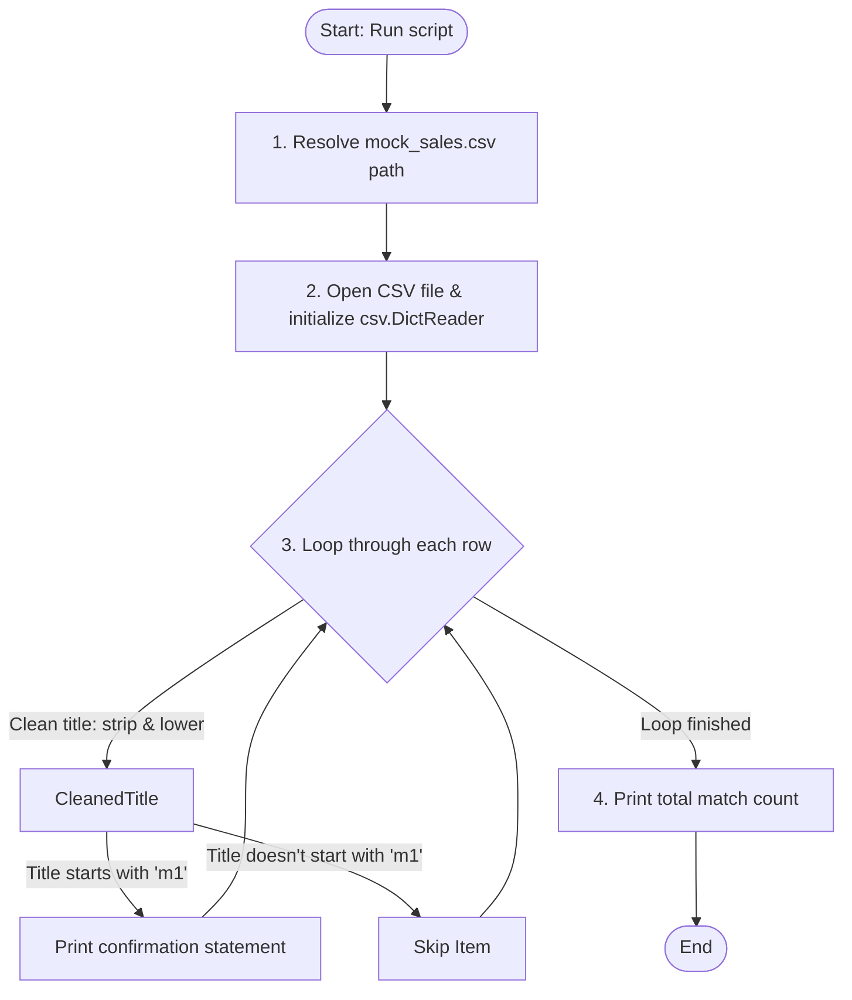

# ConsignFlow Scanner Architecture

Welcome to the ConsignFlow Scanner! This document explains how our Python-based core scanner engine (`parser.py`) processes live-stream sales data from `mock_sales.csv` and filters the items we need.

---

## How It Works (Step-by-Step)

For a beginner, you can think of the scanner as a filter machine:

1. **Locate the CSV File**: The script (`parser.py`) automatically determines its own directory path and resolves the location of `mock_sales.csv`.
2. **Read & Import Data**: It opens the file using Python's built-in `open()` function and passes it to `csv.DictReader`. This maps each CSV row into a Python dictionary, where column headers (`Item Title`, `Sale Price`, etc.) are the keys.
3. **Filter/Scan Items with Defensive Cleaning**: It loops through each row and cleans the **Item Title**:
   * `.strip()`: Removes any leading or trailing whitespace.
   * `.lower()`: Standardizes the title to lowercase, making the check completely case-insensitive.
   * `.startswith("m1")`: Checks if the cleaned title starts with the `"m1"` prefix.
4. **Display Results**: When a match is found, it prints a clean confirmation statement displaying the item name and gross sale price. Finally, it prints the total count of matches.

---

## Visual Flowchart

Here is a visual map of how the scanner logic flows:

```text
+------------------------------------------+
|  Start: Run parser.py                    |
+------------------------------------------+
                     |
                     v
+------------------------------------------+
|  1. Locate mock_sales.csv relative path  |
+------------------------------------------+
                     |
                     v
+------------------------------------------+
|  2. Load & map rows using csv.DictReader |
+------------------------------------------+
                     |
                     v
+------------------------------------------+
|  3. Loop through each row:               |
|     Defensive cleaning: strip() + lower()|
|     Does title start with "m1"?          |
+------------------------------------------+
          /                  \
         / Yes                \ No
        v                      v
+--------------------+   +--------------------+
| Print confirmation |   | Ignore/skip item   |
| and add to count   |   +--------------------+
+--------------------+             |
         \                         /
          \                       /
           v                     v
+------------------------------------------+
|  4. Print total matching count           |
+------------------------------------------+
                     |
                     v
+------------------------------------------+
|  End                                     |
+------------------------------------------+
```

### Technical Flow Diagram
*(This renders as a graphical flowchart in compatible markdown viewers)*:


