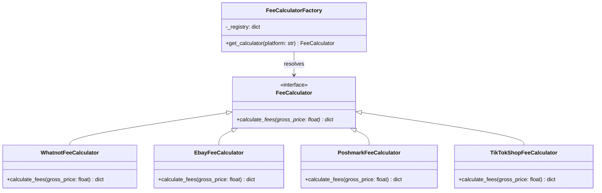

# ConsignFlow Scanner & Fee Engine Architecture

Welcome to the ConsignFlow Core Engine documentation! This architecture details the design patterns and components implemented in `parser.py` to achieve modular, extensible, and clean code suitable for production and portfolio review.

---

## Design Patterns Used

### 1. Strategy Design Pattern
To prevent `parser.py` from becoming cluttered with long, nested `if-elif-else` blocks for each marketplace's fee calculation rules, we implemented the **Strategy Pattern**.
* **Base Interface**: `FeeCalculator` is an abstract base class (using Python's `abc.ABC`) that defines a standard interface (`calculate_fees`).
* **Concrete Strategies**: Classes like `WhatnotFeeCalculator`, `EbayFeeCalculator`, `PoshmarkFeeCalculator`, and `TikTokShopFeeCalculator` implement their own specific logic for commissions, transaction fees, and flat rates.
* **Benefits**: High extensibility. If we want to add a new marketplace (e.g., Mercari), we simply write a new class implementing the interface without modifying the existing calculator code.

### 2. Simple Factory Pattern
The `FeeCalculatorFactory` acts as a central registry. It matches the platform name from the database or CSV input against standardized lowercase keys and returns the corresponding calculator object.

---

## System Workflow Diagram

```text
[ mock_sales.csv ]
        |
        v
 [ csv.DictReader ] ---> Streams rows line-by-line
        |
        +---> Clean 'Item Title' (strip, lowercase)
        |
        +---> Check if title starts with 'm1'
                 |
        +--------+ [Yes]
        |
        v
 [ FeeCalculatorFactory ] ---> Fetches calculator by 'Platform' name
        |
        +---> (Matches: Whatnot, eBay, Poshmark, or TikTok Shop)
        |
        v
 [ Specific FeeCalculator ] ---> Executes calculation strategy
        |
        v
 [ Console Payout Report ] ---> Displays Gross Price vs. calculated Net Payout
```

### UML Class Structure (Mermaid)



---

## Supported Marketplaces & Fee Structures

| Marketplace | Commission Rate | Transaction Fee | Flat Fee | Notes / Rules |
| :--- | :--- | :--- | :--- | :--- |
| **Whatnot** | 8.0% | 2.9% | $0.30 | Standard livestream rates |
| **eBay** | 13.25% | 0% | $0.30 | Collectibles/Clothing tier |
| **Poshmark** | 20.0% (>= $15) | 0% | $0.00 | Under $15.00: flat $2.95 commission |
| **TikTok Shop** | 6.0% | 0% | $0.30 | Standard seller fee |
