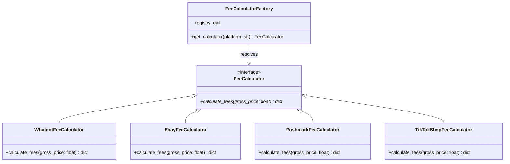

# ConsignFlow Core Architecture

Welcome to the ConsignFlow Core Engine documentation! This architecture details the design patterns, database modeling, and frontend application layers implemented in the repository.

---

## Architecture Components

ConsignFlow is structured as a modular three-tier application:

1. **Backend Engine (`parser.py`)**: Uses the **Strategy Pattern** to execute platform-specific fee calculations dynamically without logic nesting, and loads data using `csv.DictReader`.
2. **Database Layer (`schema.sql`)**: Contains a 3NF relational database schema optimized for PostgreSQL (supporting sellers, inventory, platforms, and transaction tables) utilizing UUID keys and high-throughput indexes.
3. **Presentation Layer (`app.py`)**: A Python-native Streamlit dashboard displaying business intelligence analytics, key performance indicators (KPIs), charts, and dynamic ledger searching.

---

## Design Patterns Used

### 1. Strategy Design Pattern
To prevent `parser.py` from becoming cluttered with long, nested `if-elif-else` blocks for each marketplace's fee calculation rules, we implemented the **Strategy Pattern**.
* **Base Interface**: `FeeCalculator` is an abstract base class (using Python's `abc.ABC`) that defines a standard interface (`calculate_fees`).
* **Concrete Strategies**: Classes like `WhatnotFeeCalculator`, `EbayFeeCalculator`, `PoshmarkFeeCalculator`, and `TikTokShopFeeCalculator` implement their own specific logic for commissions, transaction fees, and flat rates.
* **Benefits**: High extensibility. If we want to add a new marketplace (e.g., Mercari), we simply write a new class implementing the interface without modifying the existing calculator code.

### 2. Simple Factory Pattern
The `FeeCalculatorFactory` acts as a central registry. It matches the platform name from the database or CSV input against standardized lowercase keys and returns the corresponding calculator object.

---

## Data & Application Flow

```text
[ mock_sales.csv ]
        |
        v
 [ csv.DictReader ] ---> Streams rows line-by-line
        |
        +---> Clean 'Item Title' (strip, lowercase)
        |
        +---> Check if title starts with 'm1'
                 |
        +--------+ [Yes]
        |
        v
 [ FeeCalculatorFactory ] ---> Fetches calculator by 'Platform' name
        |
        +---> (Matches: Whatnot, eBay, Poshmark, or TikTok Shop)
        |
        v
 [ Specific FeeCalculator ] ---> Executes calculation strategy
        |
        v
 [ load_and_parse_sales() ] ---> Returns raw list and aggregated stats
        |
        +---> CLI stdout: Financial CLI dashboard (run_parser())
        |
        +---> Streamlit UI: app.py
                 |
                 +---> 1. Executive KPI Cards (Gross, Fees, Margin)
                 +---> 2. Bar Chart comparison (Gross vs. Net by Platform)
                 +---> 3. Searchable & Filterable Data Ledger Table
```

### UML Class Structure (Mermaid)


